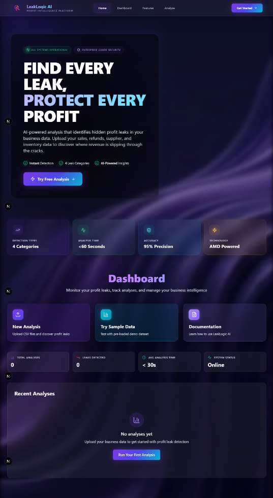
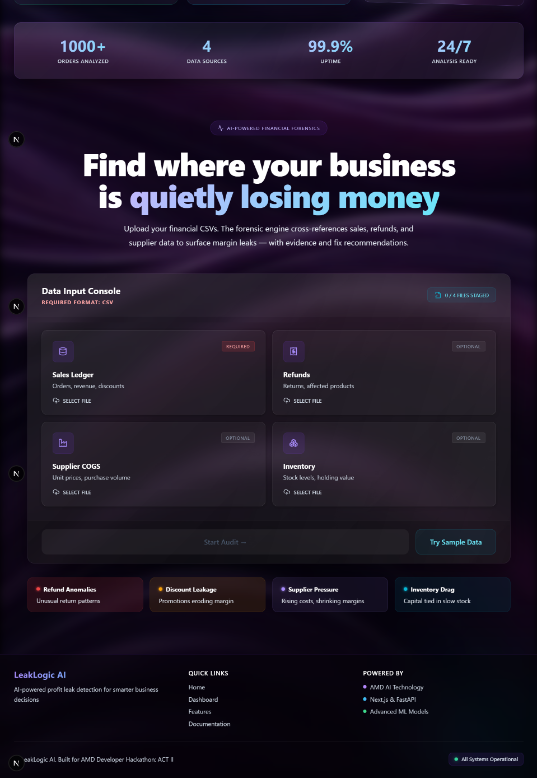
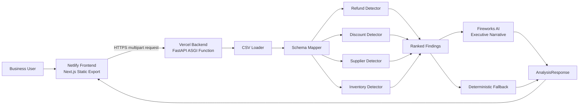

<div align="center">



# LeakLogic AI

### Find every leak. Protect every profit.

**An explainable AI business-auditing platform that detects hidden profit losses across sales, refunds, supplier costs, and inventory—then converts verified findings into an executive-ready report.**

<p>
  <a href="https://radiant-cobbler-afcae6.netlify.app">
    
  </a>
  <a href="https://leaklogicai-backend.vercel.app/health">
    
  </a>
  <a href="https://github.com/builtbyrehan/leaklogic-ai">
    
  </a>
</p>

<p>
  
  
  
  
  
</p>

</div>

---

## Built for the AMD Developer Hackathon: ACT II

<div align="center">
  <a href="https://www.amd.com/en/developer/ai-dev-program.html">
    
  </a>
  &nbsp;
  <a href="https://lablab.ai/ai-hackathons/amd-developer-hackathon-act-ii">
    
  </a>
  &nbsp;
  <a href="https://fireworks.ai">
    
  </a>
</div>

<p align="center">
Built for the <strong>AMD Developer Hackathon: ACT II</strong>, hosted on <strong>lablab.ai</strong>, with Fireworks AI used as the production narrative-inference provider.
</p>

> [!IMPORTANT]
> **AMD usage is documented transparently.** The production application uses Fireworks AI access provided through the AMD hackathon ecosystem. The event documentation states that the Fireworks-accessed models are hosted on AMD hardware. The current release does **not** claim custom ROCm kernels, direct AMD Developer Cloud execution, or model training on an AMD GPU pod unless those components are later implemented and verified.

---

## Quick Links

| Resource | URL |
|---|---|
| 🌐 Production frontend | [radiant-cobbler-afcae6.netlify.app](https://radiant-cobbler-afcae6.netlify.app) |
| ⚙️ Production backend | [leaklogicai-backend.vercel.app](https://leaklogicai-backend.vercel.app) |
| 💚 API health check | [Backend `/health`](https://leaklogicai-backend.vercel.app/health) |
| 💻 Source code | [github.com/builtbyrehan/leaklogic-ai](https://github.com/builtbyrehan/leaklogic-ai) |
| 🏆 Hackathon | [AMD Developer Hackathon: ACT II](https://lablab.ai/ai-hackathons/amd-developer-hackathon-act-ii) |

---

## Table of Contents

- [Why LeakLogic AI](#why-leaklogic-ai)
- [What the Platform Detects](#what-the-platform-detects)
- [Core Capabilities](#core-capabilities)
- [Production Architecture](#production-architecture)
- [How the Analysis Works](#how-the-analysis-works)
- [AMD Architecture and Hackathon Usage](#amd-architecture-and-hackathon-usage)
- [Technology Stack](#technology-stack)
- [Repository Structure](#repository-structure)
- [Input Data Requirements](#input-data-requirements)
- [Local Development](#local-development)
- [Environment Variables](#environment-variables)
- [Docker](#docker)
- [API Reference](#api-reference)
- [Example Response](#example-response)
- [Deployment](#deployment)
- [Deployment Fixes and Lessons Learned](#deployment-fixes-and-lessons-learned)
- [Reliability and AI Safety](#reliability-and-ai-safety)
- [Security and Privacy](#security-and-privacy)
- [Testing](#testing)
- [Troubleshooting](#troubleshooting)
- [Known Limitations](#known-limitations)
- [Roadmap](#roadmap)
- [Team](#team)
- [Acknowledgements](#acknowledgements)
- [License](#license)

---

## Why LeakLogic AI?

Businesses do not always lose money through one major failure. Profit often disappears through smaller, recurring operational issues:

- promotions that reduce revenue without meaningful sales lift;
- products with abnormal refund patterns;
- supplier-cost increases that quietly compress margin;
- slow or accumulating inventory that locks up working capital;
- disconnected files that make cross-functional analysis difficult.

Traditional dashboards usually show **what happened**. LeakLogic AI focuses on:

> **Where is profit leaking, how much is at risk, what evidence supports the finding, and what should be reviewed next?**

### Value in 30 Seconds

| Challenge | LeakLogic AI response |
|---|---|
| Disconnected business data | Combines sales, refunds, suppliers, and inventory |
| Slow spreadsheet auditing | Runs four automated leak detectors |
| Unclear financial priority | Ranks findings by estimated dollar impact |
| Black-box AI output | Calculates findings deterministically before using an LLM |
| Technical results are hard to present | Generates an executive-ready narrative |
| AI provider temporarily fails | Returns a deterministic fallback summary |

---

## What the Platform Detects

| Detector | What it analyzes | Example signal |
|---|---|---|
| ↩️ **Refund Anomalies** | Refund volume, rate, and financial impact | A product or category experiences a material refund spike |
| 🏷️ **Discount Leakage** | Discount cost, revenue per unit, and sales lift | A promotion lowers revenue without generating enough incremental sales |
| 📦 **Supplier Pressure** | Supplier unit-cost changes and margin exposure | Costs rise while selling-price behavior does not compensate |
| 🧊 **Inventory Drag** | Stock movement, accumulation, and tied-up value | Inventory grows or remains stagnant while sales movement is weak |

---

## Core Capabilities

### Explainable Profit-Leak Findings

Every finding can include:

- category;
- affected product, supplier, or segment;
- metric change;
- estimated dollar impact;
- confidence score;
- analysis time window;
- supporting evidence;
- likely cause;
- recommended action.

### Grounded Executive Narrative

Fireworks AI receives the **structured detector output**, not raw permission to invent a business story. The narrative prompt explicitly prevents unsupported:

- figures;
- causes;
- dates;
- thresholds;
- recovery estimates;
- findings;
- recommendations.

### Resilient Fallback

The application still completes an audit when the LLM is unavailable. Deterministic findings and a fallback summary are returned instead of failing the entire request.

### Interactive Web Experience

The frontend includes:

- file upload cards;
- sample-data analysis;
- total leak summary;
- ranked forensic findings;
- revenue-over-time charts;
- source-record statistics;
- AI narrative source badge;
- responsive report layout.

### Portable Delivery

The repository contains:

- backend Dockerfile;
- frontend Dockerfile;
- Docker Compose configuration;
- `.dockerignore` files;
- dynamic backend port support;
- deployment-specific environment configuration.

---

## Product Preview

<div align="center">
  
</div>

---

## Production Architecture



### Deployed Flow

```text
Netlify Next.js Frontend
        ↓ HTTPS
Vercel FastAPI Backend
        ↓
Python + pandas Deterministic Detectors
        ↓
Fireworks AI Narrative Generation
        ↓
Executive Audit Dashboard
```

### Production Services

| Layer | Platform | Responsibility |
|---|---|---|
| Frontend | Netlify | Hosts the exported Next.js interface |
| Backend | Vercel | Runs the FastAPI ASGI application |
| AI inference | Fireworks AI | Generates the grounded executive narrative |
| Source control | GitHub | Stores code and drives deployments |
| Local parity | Docker Compose | Runs the frontend and backend consistently |

---

## How the Analysis Works

1. **Upload**  
   The user uploads a required sales CSV and optional refund, supplier, and inventory files.

2. **Validate**  
   FastAPI validates the multipart request and ensures a usable sales file is present.

3. **Normalize**  
   The schema mapper converts supported column-name variations into a consistent internal format.

4. **Detect**  
   Each available dataset is sent to its relevant deterministic detector.

5. **Estimate impact**  
   The pipeline calculates the estimated financial impact of each finding.

6. **Rank findings**  
   Results are sorted by financial importance.

7. **Generate narrative**  
   Fireworks AI turns the structured results into an executive summary.

8. **Fallback safely**  
   If AI generation fails, a deterministic summary is returned.

9. **Visualize**  
   The frontend renders findings, evidence, actions, source counts, and charts.

---

## AMD Architecture and Hackathon Usage

### Verified Use in the Current Build

| AMD-related component | How it is used |
|---|---|
| AMD Developer Hackathon: ACT II | LeakLogic AI was developed for the hackathon's Unicorn Track |
| AMD AI Developer Program | Provided access to hackathon learning resources and AI credits |
| Fireworks AI credits | Used for the production executive-narrative layer |
| AMD-hosted inference path | The event documentation describes Fireworks-accessed models as hosted on AMD hardware |
| Containerization | The project is Dockerized in alignment with the hackathon submission requirement |

### What Runs Where

```text
Deterministic analytics:
Python + pandas inside the FastAPI backend

Executive narrative:
Fireworks AI API using the configured GPT-OSS model

Production frontend:
Netlify

Production backend:
Vercel

Local container validation:
Docker Desktop + Docker Compose
```

### Honest Scope Disclosure

The current production release does **not** claim:

- custom ROCm kernel development;
- direct training or fine-tuning on AMD Developer Cloud;
- a self-hosted model on an AMD GPU pod;
- GPU acceleration of pandas detectors;
- that Netlify or Vercel themselves run this application on AMD hardware.

These are valid future extensions and are tracked in the roadmap.

> The “AMD Powered” product messaging refers to the hackathon ecosystem and AMD-backed AI inference access—not to every deployed service in the stack.

---

## Technology Stack

<div align="center">

### Frontend


### Backend and Analytics


<p>
  
  
  
</p>

### AI, DevOps and Deployment


<p>
  
  
</p>

</div>

### Detailed Stack

| Area | Technologies |
|---|---|
| Frontend | Next.js 16, React 19, TypeScript, Tailwind CSS |
| Visualization | Recharts |
| Markdown | React Markdown, remark-gfm |
| UI | Lucide React, Spline |
| Backend | Python 3.12, FastAPI, Uvicorn |
| Data | pandas, NumPy |
| Validation | Pydantic, pydantic-settings |
| AI | Fireworks AI, OpenAI-compatible client |
| Containerization | Docker, Docker Compose |
| Frontend deployment | Netlify |
| Backend deployment | Vercel |
| Version control | GitHub |

---

## Repository Structure

```text
profit-leak-hunter/
├── backend/
│   ├── app/
│   │   ├── core/
│   │   │   └── config.py
│   │   ├── sample_data/
│   │   │   ├── sales.csv
│   │   │   ├── refunds.csv
│   │   │   ├── suppliers.csv
│   │   │   └── inventory.csv
│   │   ├── services/
│   │   │   ├── detectors/
│   │   │   │   ├── discounts.py
│   │   │   │   ├── inventory.py
│   │   │   │   ├── refunds.py
│   │   │   │   └── suppliers.py
│   │   │   ├── csv_loader.py
│   │   │   ├── narrative.py
│   │   │   ├── pipeline.py
│   │   │   └── schema_mapper.py
│   │   ├── app.py
│   │   ├── main.py
│   │   └── schemas.py
│   ├── tests/
│   ├── .dockerignore
│   ├── .env.example
│   ├── Dockerfile
│   └── requirements.txt
│
├── frontend/
│   ├── app/
│   ├── components/
│   ├── lib/
│   │   └── api.ts
│   ├── public/
│   ├── types/
│   ├── .dockerignore
│   ├── Dockerfile
│   ├── next.config.ts
│   ├── package.json
│   └── package-lock.json
│
├── docs/
│   └── assets/
│       ├── leaklogic-dashboard.png
│       ├── leaklogic-hero-dashboard.png
│       └── leaklogic-audit-console.png
├── scripts/
├── compose.yml
├── netlify.toml
├── .env.example
├── .gitignore
└── README.md
```

---

## Input Data Requirements

Only the **sales CSV** is mandatory.

<details>
<summary><strong>Sales CSV — required</strong></summary>

| Column | Type | Description |
|---|---|---|
| `date` | Date | Transaction date |
| `product` | Text | Product or category |
| `quantity` | Numeric | Units sold |
| `unit_price` | Numeric | Selling price per unit |
| `discount` | Numeric | Discount amount or rate |
| `supplier` | Text | Supplier, when available |

```csv
date,product,quantity,unit_price,discount,supplier
2019-01-01,Sports and travel,4,95.00,5.00,Global Sports Ltd
2019-01-02,Electronic accessories,2,40.00,0.00,TechWholesale Inc
```

</details>

<details>
<summary><strong>Refunds CSV — optional</strong></summary>

| Column | Type | Description |
|---|---|---|
| `date` | Date | Refund date |
| `product` | Text | Refunded product |
| `quantity` | Numeric | Refunded units |
| `amount` | Numeric | Refund amount |

```csv
date,product,quantity,amount
2019-02-05,Sports and travel,2,180.00
```

</details>

<details>
<summary><strong>Suppliers CSV — optional</strong></summary>

| Column | Type | Description |
|---|---|---|
| `supplier` | Text | Supplier name |
| `product` | Text | Product |
| `unit_cost` | Numeric | Supplier cost per unit |
| `date` | Date | Cost record date |

```csv
supplier,product,unit_cost,date
TechWholesale Inc,Electronic accessories,34.00,2019-01-01
TechWholesale Inc,Electronic accessories,40.00,2019-03-01
```

</details>

<details>
<summary><strong>Inventory CSV — optional</strong></summary>

| Column | Type | Description |
|---|---|---|
| `product` | Text | Product |
| `stock_level` | Numeric | Available stock |
| `unit_cost` | Numeric | Cost per unit |
| `snapshot_date` | Date | Inventory snapshot date |

```csv
product,stock_level,unit_cost,snapshot_date
Home and lifestyle,650,44.00,2019-03-31
```

</details>

---

## Local Development

### Prerequisites

- Git
- Python 3.12+
- Node.js 22+
- npm
- Docker Desktop, for containerized execution

### Clone

```bash
git clone https://github.com/builtbyrehan/leaklogic-ai.git
cd leaklogic-ai
```

### Backend

```powershell
cd backend
python -m venv .venv
.venv\Scripts\activate
pip install -r requirements.txt
Copy-Item .env.example .env
python -m uvicorn app.main:app --reload
```

Available locally:

```text
API:      http://127.0.0.1:8000
Health:   http://127.0.0.1:8000/health
Swagger:  http://127.0.0.1:8000/docs
```

### Frontend

```powershell
cd frontend
npm install
npm run dev
```

Open:

```text
http://localhost:3000
```

---

## Environment Variables

### Backend — `backend/.env`

```env
APP_ENV=development

LLM_PROVIDER=fireworks
ENABLE_LLM_NARRATIVE=true

FIREWORKS_API_KEY=your_private_fireworks_api_key
FIREWORKS_API_BASE_URL=https://api.fireworks.ai/inference/v1
FIREWORKS_MODEL=accounts/fireworks/models/gpt-oss-120b

OPENROUTER_API_KEY=
OPENROUTER_API_BASE_URL=https://openrouter.ai/api/v1
OPENROUTER_MODEL=nvidia/nemotron-3-nano-30b-a3b:free
```

### Frontend — `frontend/.env.local`

```env
NEXT_PUBLIC_API_URL=http://127.0.0.1:8000
```

### Production Values

Vercel backend:

```env
APP_ENV=production
LLM_PROVIDER=fireworks
ENABLE_LLM_NARRATIVE=true
FIREWORKS_API_KEY=stored_as_a_private_platform_secret
FIREWORKS_API_BASE_URL=https://api.fireworks.ai/inference/v1
FIREWORKS_MODEL=accounts/fireworks/models/gpt-oss-120b
```

Netlify frontend:

```env
NEXT_PUBLIC_API_URL=https://leaklogicai-backend.vercel.app
```

> [!CAUTION]
> Never commit `.env`, `.env.local`, API keys, or production secrets.

---

## Docker

### Run the Full Application

```bash
docker compose up --build
```

Open:

```text
Frontend: http://localhost:3000
Backend:  http://localhost:8000
Swagger:  http://localhost:8000/docs
```

Stop:

```bash
docker compose down
```

### Build Separately

```bash
docker build -t leaklogic-backend ./backend
docker build -t leaklogic-frontend ./frontend
```

### Cloud-Compatible Backend Command

```dockerfile
CMD ["sh", "-c", "uvicorn app.main:app --host 0.0.0.0 --port ${PORT:-8000}"]
```

This allows the container to use a cloud-provided port while defaulting to `8000` locally.

---

## API Reference

### Health Check

```http
GET /health
```

```json
{
  "status": "ok",
  "service": "profit-leak-hunter-api",
  "version": "0.1.0"
}
```

### Sample Data

```http
GET /sample-data/{filename}
```

Supported demo files:

```text
sales.csv
refunds.csv
suppliers.csv
inventory.csv
```

### Analyze

```http
POST /analyze
```

Content type:

```text
multipart/form-data
```

| Field | Required | Description |
|---|---:|---|
| `sales` | Yes | Sales CSV |
| `refunds` | No | Refund CSV |
| `suppliers` | No | Supplier-cost CSV |
| `inventory` | No | Inventory CSV |

### cURL Example

```bash
curl -X POST "http://localhost:8000/analyze" \
  -F "sales=@backend/app/sample_data/sales.csv" \
  -F "refunds=@backend/app/sample_data/refunds.csv" \
  -F "suppliers=@backend/app/sample_data/suppliers.csv" \
  -F "inventory=@backend/app/sample_data/inventory.csv"
```

---

## Example Response

<details>
<summary><strong>View sample API response</strong></summary>

```json
{
  "status": "success",
  "total_estimated_leak": -3742.13,
  "findings": [
    {
      "category": "discount",
      "entity": "Sports and travel",
      "title": "Discount campaign may be reducing profit",
      "metric_change": "$9.30 lower revenue per unit during discounts",
      "dollar_impact": -3742.13,
      "confidence": 0.78,
      "time_window": "Discounted sales vs regular sales",
      "evidence": [
        "Total discount cost: $3,742.13",
        "Estimated incremental revenue: $0.00",
        "Discounted units sold: 319"
      ],
      "likely_cause": "The discount reduced revenue per unit more than it generated useful sales lift.",
      "suggested_action": "Review discount depth and campaign targeting for Sports and travel."
    }
  ],
  "executive_summary": "## Executive Summary...",
  "narrative_source": "fireworks",
  "amd_usage_note": "Leak findings are generated by deterministic Python/pandas detectors...",
  "chart_data": {
    "revenue_over_time": [
      {
        "month": "2019-01",
        "value": 110754.16
      }
    ],
    "records_by_source": {
      "SALES": 1000,
      "REFUNDS": 0,
      "SUPPLIERS": 0,
      "INVENTORY": 0
    },
    "date_range": "Jan 2019 - Mar 2019"
  }
}
```

</details>

---

## Deployment

### Current Production Deployment

| Component | Status | Platform | Address |
|---|---|---|---|
| Frontend | ✅ Live | Netlify | [Open frontend](https://radiant-cobbler-afcae6.netlify.app) |
| Backend | ✅ Live | Vercel | [Open backend](https://leaklogicai-backend.vercel.app) |
| Health endpoint | ✅ Verified | Vercel | [Check health](https://leaklogicai-backend.vercel.app/health) |
| AI narrative | ✅ Connected | Fireworks AI | Configured through private environment variables |
| Source repository | ✅ Active | GitHub | [Open repository](https://github.com/builtbyrehan/leaklogic-ai) |

### Frontend Deployment — Netlify

The frontend is exported as a static Next.js site.

`frontend/next.config.ts`:

```typescript
import type { NextConfig } from "next";

const nextConfig: NextConfig = {
  output: "export",
  trailingSlash: true,
  images: {
    unoptimized: true,
  },
};

export default nextConfig;
```

Root `netlify.toml`:

```toml
[build]
  base = "frontend"
  command = "npm run build"
  publish = "out"

[build.environment]
  NODE_VERSION = "22"
  NETLIFY_NEXT_PLUGIN_SKIP = "true"
```

Netlify environment variable:

```env
NEXT_PUBLIC_API_URL=https://leaklogicai-backend.vercel.app
```

### Backend Deployment — Vercel

Vercel project configuration:

```text
Framework Preset: FastAPI
Root Directory: backend
```

Supported FastAPI entrypoint:

```python
from app.main import app
```

The deployed backend health response is:

```json
{"status":"ok","service":"profit-leak-hunter-api","version":"0.1.0"}
```

### Production CORS

The backend allowlist includes the Netlify production domain:

```python
allow_origins=[
    "http://localhost:3000",
    "http://127.0.0.1:3000",
    "http://localhost:3001",
    "http://127.0.0.1:3001",
    "https://radiant-cobbler-afcae6.netlify.app",
]
```

---

## Deployment Fixes and Lessons Learned

The final deployment required several real-world fixes.

| Problem | Cause | Resolution |
|---|---|---|
| Docker API connection failed | Docker Desktop Linux engine was stopped | Started Docker Desktop and verified the server with `docker info` |
| Backend Dockerfile build issue | PowerShell backtick was used inside a Dockerfile | Replaced it with Docker-compatible `\` line continuation |
| Frontend container could not bind port 3000 | Local `npm run dev` already occupied the port | Stopped the local process before running Docker Compose |
| Fireworks returned HTTP 412 | Provider account was temporarily suspended or restricted | Resolved the account state and retested the API connection |
| Fireworks test returned `None` | Reasoning model consumed a very small token budget | Increased `max_tokens` and used low reasoning effort |
| Vercel returned `404: NOT_FOUND` | Wrong framework/root configuration produced no Python function | Selected FastAPI, set root to `backend`, added a supported entrypoint, and redeployed without cache |
| Netlify showed “Page not found” | The repository source was published instead of a built website | Enabled Next.js static export and published `frontend/out` |
| Netlify frontend could not target production API | Backend URL was not embedded during the build | Added `NEXT_PUBLIC_API_URL` with Build scope and rebuilt |
| Browser blocked frontend API calls | Production frontend origin was missing from CORS | Added the Netlify domain to the FastAPI CORS allowlist |
| Old deployment behavior persisted | Cached framework/build settings | Triggered a clear-cache deployment |

### Netlify Build Verification

A correct static build should satisfy:

```powershell
cd frontend
npm run build
Test-Path out\index.html
```

Expected:

```text
True
```

A correct Netlify publish directory contains:

```text
index.html
404.html
_next/
```

It should not publish the repository's `backend/` and `frontend/` source directories directly.

---

## Reliability and AI Safety

### Separation of Concerns

```text
Financial calculations → deterministic Python/pandas
Narrative generation    → Fireworks AI
Fallback summary        → deterministic Python
```

### Why This Matters

- The LLM does not calculate the financial findings.
- The narrative can be regenerated without changing the detector results.
- Temporary AI downtime does not disable the audit.
- Every finding contains traceable evidence.
- The response identifies whether the narrative came from Fireworks, OpenRouter, or fallback mode.

### Narrative Sources

```text
fireworks
openrouter
fallback
```

---

## Security and Privacy

### Implemented Practices

- Secrets are stored in `.env` files locally.
- Production secrets are stored in Vercel or Netlify environment settings.
- `.env` files are excluded from Git.
- The Fireworks key is never exposed to the frontend.
- CORS uses an origin allowlist.
- Uploaded files are processed by the backend analysis pipeline.
- No production database is currently required.

### Production Hardening Recommended

- authentication and authorization;
- file-size limits;
- strict MIME and extension validation;
- CSV formula-injection protection;
- request rate limiting;
- audit logging;
- data-retention controls;
- encrypted storage if persistence is added;
- secret rotation;
- dependency scanning;
- private deployments for confidential financial data.

> [!WARNING]
> Do not upload real confidential business records to an untrusted public demo environment.

---

## Testing

### Backend Tests

```powershell
cd backend
.venv\Scripts\activate
pytest
```

### Validated Scenarios

- sales only;
- sales + refunds;
- sales + suppliers;
- sales + inventory;
- all four datasets;
- missing optional files;
- empty sales input;
- Fireworks connection;
- deterministic fallback;
- Docker backend;
- Docker Compose end-to-end flow;
- deployed `/health` endpoint;
- Netlify-to-Vercel production connection.

### Manual Production Test

```text
Open the Netlify frontend
→ Click Try Sample Data
→ Start Audit
→ Confirm findings render
→ Confirm FIREWORKS AI NARRATIVE appears
```

---

## Troubleshooting

<details>
<summary><strong>Docker daemon is unavailable</strong></summary>

```powershell
docker desktop start
docker info
```

</details>

<details>
<summary><strong>Port 3000 is already in use</strong></summary>

Stop the local Next.js process with `Ctrl + C`, then:

```bash
docker compose down
docker compose up --build
```

</details>

<details>
<summary><strong>Frontend cannot reach backend</strong></summary>

Local:

```env
NEXT_PUBLIC_API_URL=http://127.0.0.1:8000
```

Production:

```env
NEXT_PUBLIC_API_URL=https://leaklogicai-backend.vercel.app
```

Rebuild after changing a `NEXT_PUBLIC_*` value.

</details>

<details>
<summary><strong>Netlify returns 404</strong></summary>

Confirm:

```text
Base directory: frontend
Build command: npm run build
Publish directory: out
```

Then run a clear-cache deployment.

</details>

<details>
<summary><strong>Vercel returns 404</strong></summary>

Confirm:

```text
Framework Preset: FastAPI
Root Directory: backend
```

Verify the supported entrypoint exists and redeploy without cache.

</details>

<details>
<summary><strong>Narrative falls back</strong></summary>

Verify:

```env
LLM_PROVIDER=fireworks
ENABLE_LLM_NARRATIVE=true
FIREWORKS_API_KEY=...
```

Then inspect backend logs for the failed narrative attempt.

</details>

---

## Known Limitations

- CSV is the only supported upload format.
- The schema mapper does not support every enterprise naming convention.
- Detector thresholds are rule-based and may need industry calibration.
- Financial impact is an analytical estimate, not an audited accounting result.
- Recommendations require professional review.
- Authentication and user accounts are not yet implemented.
- Analysis history is not persisted.
- The current public deployment is designed for demonstration.
- Direct AMD Developer Cloud and custom ROCm execution are not part of the current production release.
- The system supports decision-making; it does not automate financial controls.

---

## Roadmap

### Completed

- [x] CSV ingestion
- [x] schema mapping
- [x] four deterministic leak detectors
- [x] financial-impact ranking
- [x] grounded Fireworks AI narrative
- [x] OpenRouter-compatible provider option
- [x] deterministic fallback
- [x] FastAPI backend
- [x] Next.js dashboard
- [x] Markdown report rendering
- [x] Dockerized frontend and backend
- [x] Docker Compose
- [x] Vercel backend deployment
- [x] Netlify frontend deployment
- [x] production CORS
- [x] production environment configuration

### Next

- [ ] authentication and user accounts
- [ ] persistent audit history
- [ ] PostgreSQL integration
- [ ] downloadable PDF reports
- [ ] downloadable CSV findings
- [ ] configurable detector thresholds
- [ ] automated data-quality score
- [ ] scheduled audits and alerts
- [ ] role-based access control
- [ ] CI/CD test gates
- [ ] dependency and container scanning
- [ ] AMD Developer Cloud workload
- [ ] ROCm acceleration benchmark
- [ ] production observability
- [ ] custom domain

---

## Team

<div align="center">

| Team Member | Contribution |
|---|---|
| **Muhammad Rehan** | Project leadership, backend, AI integration, deployment |
| **Ehtisham Tahir** | Core project team |
| **Gul-e-Zara** | Core project team |
| **Neha** | Core project team |
| **Zokirjanov Jasurbek** | Core project team |

</div>

> Update the contribution labels above with each member's final verified responsibilities before submission.

---

## Acknowledgements

LeakLogic AI acknowledges:

- **AMD** for the AI Developer Program, hackathon ecosystem, cloud and AI resources;
- **lablab.ai** for hosting and organizing the AMD Developer Hackathon: ACT II;
- **Fireworks AI** for the production inference API;
- **Netlify** for frontend hosting;
- **Vercel** for FastAPI backend hosting;
- the open-source communities behind FastAPI, Next.js, pandas, React, Tailwind CSS, Docker, and the supporting libraries used in this project.

### Trademark Notice

AMD, lablab.ai, Fireworks AI, Netlify, Vercel, and all other product names and logos are trademarks of their respective owners. Their appearance in this README identifies technologies, platforms, event participation, or acknowledgements and does not imply additional endorsement beyond the documented relationship.

---

## License

No open-source license is currently declared.

Until a `LICENSE` file is added, the repository remains under the copyright rights of its owner. Add a license before inviting unrestricted external reuse.

---

<div align="center">

### Ready to see where the money is leaking?

<a href="https://radiant-cobbler-afcae6.netlify.app">
  
</a>

<br><br>

**LeakLogic AI — Find every leak. Protect every profit.**

</div>
